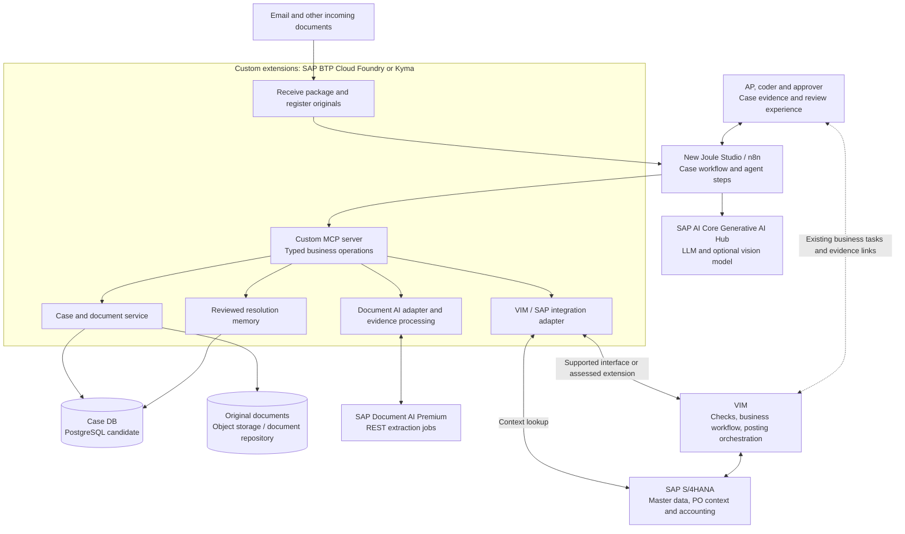

# Sony invoice architecture explainer

An interactive explainer for the proposed target architecture of Sony's non-trade invoice processing (APAC, Europe and North America). It shows how an incoming invoice and its supporting evidence become one persistent case:

- SAP Document AI Premium extracts the data.
- The new Joule Studio with n8n orchestrates the work.
- SAP AI Core Generative AI Hub helps with interpretation and suggestions.
- Custom MCP tools on SAP BTP connect the pieces.
- The existing VIM and SAP S/4HANA business core is reused where feasible.

The explainer has two views:

- **The architecture:** explore each component and compare VIM integration approaches A, B and C.
- **Follow an invoice:** step through three stories: a non-PO invoice with an Excel backup, a PO line-matching exception, and a late supporting document.

All suppliers, amounts and outcomes are illustrative. No SAP system is connected.

## Architecture at a glance



The full rationale, assumptions and sources are in [architecture/architecture.md](architecture/architecture.md).

## Contents

| Path | Purpose |
| --- | --- |
| `architecture/sony-invoice-explainer.html` | The explainer: a single self-contained HTML file that also works offline ([presenter tips](architecture/README.md)) |
| `architecture/architecture.md` | Architecture document (source of truth for rationale, assumptions and sources) |
| `architecture/architecture.html` | Readable page generated from `architecture.md` in the explainer's style; the deployed explainer's document link opens it |
| `architecture/sony-invoice-takeaway.pdf` | Printable two-page takeaway |
| `architecture/sonylogo.svg` | Sony logo, inlined in both page headers |
| `scripts/` | Build script and page template for `architecture.html` |
| `kustomization.yaml`, `k8s/` | Deployment to SAP BTP Kyma |

## Deployment

The explainer runs at **https://sony-vim-explainer.a549aaa.kyma.ondemand.com**, in the `sony-vim-explainer` namespace of the a549 Kyma cluster. A stock `nginx-unprivileged` container serves the explainer and the architecture page from a ConfigMap, behind one shared basic-auth login. There is no image to build.

The login lives in `k8s/htpasswd`, which is gitignored and deployed as a Kubernetes Secret. To deploy, or to change the password:

```bash
htpasswd -cB k8s/htpasswd sony   # prompts for the shared password
kubectl apply -k .
```

After you edit the explainer, run `kubectl apply -k .` again. The pod picks up the new content automatically.

After you edit `architecture.md`, regenerate its page before deploying. This needs Node.js; the diagram is drawn with a headless Chrome.

```bash
npm install      # once
npm run build    # writes architecture/architecture.html
kubectl apply -k .
```
