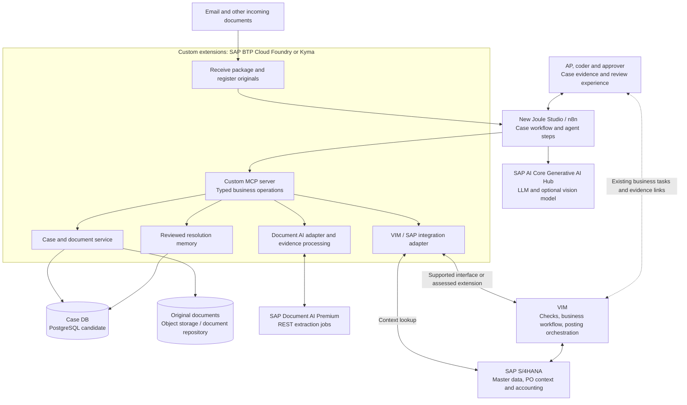

# Sony non-trade invoice processing: target architecture

Version 0.1 | 11 September 2026 | Working architecture for discussion

## 1. Architecture decision

Build a case-based invoice processing solution on SAP BTP, using **SAP Document AI Premium Edition** for document ingestion and extraction, **the new Joule Studio with n8n** for workflow orchestration, and **SAP AI Core Generative AI Hub** for additional reasoning and optional vision-based classification.

Custom services run on **SAP BTP Cloud Foundry or Kyma** and expose business operations through a **custom MCP server integrated with Joule Studio**. Persist each invoice case in a **database, with PostgreSQL as the initial candidate**, and keep original files in document/object storage or a suitable existing repository.

The preferred architecture retains **VIM's existing business checks, exception workflows, coding/approval routing, and posting orchestration**, with accounting executed in SAP. The new layer supplies better extracted data, complete supporting evidence, and assistance with resolution and coding. This reuse is conditional on the integration capabilities of Sony's installed or target VIM environment.

S/4HANA is the target ERP assumption in every branch. Exact releases and interfaces remain implementation dependencies; they do not block this high-level design.

## 2. Business scope and evidence

| Item | Architecture baseline | Evidence status |
| --- | --- | --- |
| Process | Non-trade/indirect procurement invoices, including PO and non-PO | Customer scope |
| Geography | APAC, Europe, North America; Japan and China excluded | Customer answer |
| Annual volume | Approximately 77,000 PO and 107,000 non-PO records | Customer answer |
| Processing outcomes | 140,000 posted and 44,000 duplicate, returned, or obsolete records | Customer answer; reporting period not explicit |
| Sizing assumption | Approximately 184,000 incoming records annually | Provisional reconciliation of the two totals; not a touchless-processing or OCR-accuracy measure |
| PO coding | Account assignment determined when the PO is created | Customer answer |
| Non-PO coding | Coder supplies G/L and cost objects based on budget/accounting agreement | Customer answer; no complete deterministic coding rules provided |
| Supporting evidence | Missing backup in the current approval experience delays approval; backup also supports cost splits | Customer answer |
| Mozart | S/4HANA Central Finance system | Customer clarification; VIM location/version unconfirmed |

The workbook supplies representative rules and actions, not a verified inventory of active configuration. Its Exception Reasons, Mozart RDD, and GSAP sheets must remain distinguishable. Some entries are marked for removal pending confirmation. [S1, S2]

Payment execution, bank interfaces, and post-posting RTR reallocations are outside this architecture. Payment-run examples inform an optional early-check extension only. [S1, S7]

## 3. Logical component architecture

This is a logical diagram. The inbound adapter uses the case service to save originals before triggering work. The MCP server is the tool contract; the underlying services implement operations and can also expose normal APIs for deterministic workflow nodes, callbacks, and UI access. Files move through service adapters; workflow and agent context primarily carry case IDs and relevant evidence.

### Component responsibilities

| Component | Responsibility |
| --- | --- |
| Package reception | Receive email/files, preserve their original association, identify repeat deliveries, trigger or resume processing |
| Document AI Premium | Extract invoice headers/lines and information from supporting documents using selected standard/custom schemas |
| Joule Studio / n8n | Sequence processing, invoke tools and agents, wait for results/people, retry technical failures, coordinate case progress |
| Generative AI Hub | Provide models for optional classification, evidence interpretation, exception recommendations, and coding suggestions [S8] |
| Custom MCP server | Expose bounded case, extraction, SAP lookup, VIM action, and memory operations |
| Extension runtime | Host the MCP server, adapters, case services, and supporting-document processing |
| Database | Store case state, document relationships, extracted versions, decisions, external IDs, and reviewed resolutions |
| File repository | Preserve original email, invoices, spreadsheets, and other evidence; retain any derived versions separately |
| VIM / SAP | Execute authoritative checks and configured business actions; maintain SAP business records and posting results |

**Runtime distinction:** the supplied Joule Studio architecture describes an SAP-managed Kyma runtime. Our custom extension runtime is a separate deployment choice: Cloud Foundry for conventional service hosting, or customer BTP Kyma where Kubernetes deployment is appropriate. The proposal does not require Sony to host Joule Studio's n8n engine itself. Deployment of custom assets inside the managed Joule runtime is an alternative only if supported in the available release. [S4, slides 6 and 11]

## 4. Document ingestion and extraction

Document AI is the core document-ingestion/extraction service. A small surrounding intake service still owns mailbox connectivity, package preservation, and relationships across invoices and later emails. Accepting an email file for extraction does not by itself establish those case-management behaviors.

1. **Register the received package.** Preserve the email and all attachments before classifying them. Keep non-invoice attachments available as potential evidence.
2. **Identify document roles and invoice boundaries.** Separate invoices, credit notes requiring an applicable process, supporting documents, and unrelated material. A cheap classifier using a suitable Generative AI Hub model is optional. Ambiguous candidates proceed to Document AI or review; they are not silently discarded.
3. **Create or associate invoice cases.** One invoice normally has one case, potentially with multiple source files/pages. An email containing several invoices produces several linked cases. Uncertain associations remain pending confirmation.
4. **Run Document AI jobs.** Use the predefined invoice document type and an explicitly selected extraction schema. Use custom schemas for relevant supporting information. Structured invoice payloads can take a parsing/mapping path without unnecessary visual extraction, then undergo the same business validation.
5. **Normalize and enrich.** Preserve extracted values separately from normalized or SAP-derived values. Resolve vendor/company/PO identifiers against SAP context, using Document AI enrichment where suitable or adapter lookups. This accounts for enrichment and correction functions historically present in ICC. [S6, PDF page 9]
6. **Persist results and evidence.** Save the extraction job ID, schema version, raw response, normalized values, validation findings, and document references under the case.

### Document AI choices grounded in the supplied documentation

- Premium provides both Basic UI/REST and Workspace/OData V4 families. **The baseline uses REST APIs**; Workspace channels/workflows are optional and do not become a second end-to-end workflow owner. [S3, pages 6, 18, 208]
- Invoice is a predefined document type; Premium also supports generative extraction for standard and custom documents. **Buying Premium alone does not select generative extraction for every field.** For the documented Basic UI/REST schema setup, `auto` with a default extractor uses the service's ML models; `auto` without a default extractor uses generative AI. Configure this deliberately. [S3, pages 183-184, 369-370]
- Premium REST supports PDFs, images, Excel, Word, email formats, and other listed formats. Supporting spreadsheets can use Document AI custom schemas; a native spreadsheet reader may additionally preserve exact cell references, formulas, and allocation arithmetic when needed. File-format support does not guarantee correct interpretation of every spreadsheet layout. [S3, pages 189-190]
- Japanese is supported, although Japan remains outside the customer scope. Barcode information can be retained when relevant to identification or evidence. These are service capabilities, not new scope requirements. [S3, pages 200, 248]
- The initial adapter uses `POST /document-information-extraction/v1/document/jobs` and `GET /document-information-extraction/v1/document/jobs/<id>`. These are documented Document AI endpoints, unlike the conceptual VIM tool names below. [S3, pages 235, 247]
- Processing is asynchronous. Persist job IDs and resume the case after completion. Notifications are optional; the documented callback is sent once without retry, so include scheduled reconciliation/polling for jobs whose completion notification is missed. [S3, page 339]
- Generative-extraction confidence scores and field coordinates are not reliable automation gates according to SAP's documentation. Progression depends on business validation, sufficient evidence, and permitted actions. Preserve full originals and mark uncertain source locations instead of presenting every bounding box as verified. [S3, page 401]
- Enforce file/page limits and recognize complex table layouts before submission. Route unsupported or oversized material for controlled preprocessing or review; never silently truncate allocation evidence. Exact service limits belong in implementation configuration. [S3, pages 652-653]

## 5. Case persistence and ownership

Use a relational **case DB**, initially represented as **DB / PostgreSQL**. No identified requirement currently necessitates HANA Cloud. The physical file store may reuse a suitable existing repository or use object storage; the architecture does not depend on a specific storage vendor.

| Case information | Contents |
| --- | --- |
| Identity and context | Stable case ID, source package IDs, company/entity, region, PO/non-PO classification, current version |
| Documents | Original references, file hashes, document roles, versions, association evidence, pending associations |
| Extraction and evidence | Document AI job IDs, schemas, raw/normalized values, source references and uncertainty |
| Business state | Validation results, open exceptions, coding proposal, human task references and outcomes |
| External identity | VIM document ID, SAP document/company/year references, repository identifiers, workflow execution IDs |
| History and memory | Actions proposed/taken, actor, rationale, validation outcome, reviewed reusable resolutions |

An Excel file supporting several invoices is logically present in every relevant case. Prefer one preserved file with multiple case links; physical copies are acceptable when required by a target repository or VIM interface. Keep a common source identity so a later revision is handled consistently.

Late documents attach to an existing case when association is established and may restart affected validation/coding. Material changes invalidate stale proposals or approvals where applicable. Already-posted cases retain new evidence and route any accounting change through the appropriate follow-up process.

**Ownership:** the case DB is authoritative for document associations and new-layer work. VIM/SAP remains authoritative for its business status, approvals, and accounting. n8n owns orchestration execution state. Persist correlations and reconcile these states; a completed workflow node is not proof of an SAP posting.

Illustrative case progression: received → associated → extracting → validating → resolving/coding → approval where required → posting confirmed → completed. Waiting for information, review, technical retry, returned, duplicate, and obsolete are explicit branches. PO checks, coding, and validation can loop; the exact approval/posting order follows the applicable VIM process rather than imposing one universal sequence.

## 6. Validation, exception resolution, and coding

The MCP-exposed VIM adapter submits data into a supported process and reads available results. It may need to create/update a VIM document before checks can run; we do not assume the existing rules are exposed as a stateless remote rule engine.

| Exception family | Representative customer evidence | Proposed response |
| --- | --- | --- |
| Extraction or completeness | Missing mandatory fields, invalid currency, balance not zero | Recheck original, propose correction, rerun checks; return if the source is genuinely invalid |
| SAP reference mismatch | Vendor/entity mismatch, invalid PO, currency mismatch | Fetch current SAP context, explain discrepancy, propose permitted action or route to owner |
| PO matching | Indexing-line problems, quantity validation, price variance | Propose line matches using invoice/PO context; existing checks validate quantities, amounts, tolerances and receipt requirements |
| Information or routing | Awaiting information, reply received, invalid requisitioner, no coder | Associate replies, prepare requests, locate responsible role, resume once information is available |
| Business decision | Suspected duplicate, RTV, bypass, approval | Gather evidence and execute only the action permitted for the role and process |
| Non-PO coding | AP coding required; backup-driven cost splits | Propose G/L and cost objects using backup, agreed context and reviewed history; validate assignments and allocation totals |

Source: customer workbook and answers. Bypass availability in the workbook is evidence of a configured option, not blanket permission for AI to bypass a rule. [S1, S2]

**PO route:** reuse account assignment from the purchase order. Use matching assistance when invoice descriptions or line structure differ. Apply receipt/service-entry checks only where the purchasing process requires them; indirect procurement does not imply a universal goods-receipt process.

**Non-PO route:** evidence-based coding assistance is central. A recurring supplier alone is insufficient to determine a cost center. Retrieve relevant entity/service/budget context and reviewed examples, show the proposal and allocation evidence, then apply the configured confirmation policy. The initial showcase can assume coder confirmation, with automatic handling illustrated for specifically permitted recurring cases.

### Learning loop

After resolution and validation, asynchronously store a reviewed example: problem, business context, supporting evidence, proposed action, accepted/corrected action, and outcome. Retrieve comparable examples for later cases, scoped by entity, process, and applicable rules. This is application memory, separate from Document AI instant learning or SAP data-feedback collection.

Repeated successful outcomes can support a proposal for a new automation policy. They do not silently rewrite business rules. Documents and email bodies are evidence, not instructions that can authorize tools or change policy.

## 7. Workflow and human interaction

n8n coordinates deterministic service calls, agent reasoning, decisions, and human waits. Most stages do not need an autonomous agent. Use reasoning where interpretation or a choice among actions is required, and ordinary workflow steps for saving files, arithmetic, status checks, and known API calls.

The supplied three-way-match example inspires the pattern: gather SAP context, attempt resolution, escalate when needed, evaluate conditions for action, involve a human, execute in SAP, and record outcomes. Its specialist-agent topology and example endpoints are not requirements for Sony. [S5, slides 11-16]

For the preferred reuse branch, VIM continues to own its coding/approval tasks. The new case experience makes the complete invoice-and-backup package accessible and supplies recommendations. A supporting review app can be hosted with the extensions and linked from existing work where supported. If native evidence integration is unavailable, use a linked case view. Do not create a second independent approval for the same business decision.

The workflow waits for an authoritative decision and resumes with the approved case version. A rejection routes to correction, return, or closure; approval triggers the permitted next action, followed by confirmation of the SAP outcome. Human waits must not hold an MCP request open.

Operational requirements are modest but essential: idempotent intake and business actions, retryable technical calls, bounded resolution attempts, case-version checks before changes, and status reconciliation after timeouts. Technical duplicate-delivery detection remains distinct from business duplicate-invoice validation.

## 8. Custom MCP tools and integration boundary

The following are **proposed custom tool contracts**, not claims about existing SAP or VIM API names. They can initially be implemented in one service deployment with a single MCP facade.

| Tool group | Illustrative operations | Backend |
| --- | --- | --- |
| Cases | `get_case`, `associate_document`, `record_case_event` | Case service and persistence |
| Extraction | `start_extraction`, `get_extraction_result` | Document AI REST adapter |
| SAP context | `get_supplier_context`, `get_po_context`, `get_valid_cost_objects` | Applicable SAP read interfaces |
| VIM processing | `submit_invoice`, `get_processing_status`, `get_exceptions`, `apply_permitted_correction`, `request_revalidation` | Supported VIM interface or assessed extension |
| Coding | `propose_coding`, `validate_coding`, `apply_confirmed_coding` | Evidence, AI service, SAP/VIM adapter |
| Resolution memory | `find_reviewed_resolutions`, `record_reviewed_resolution` | Database and optional retrieval index |

Mutating tools validate identity, process permission, case version, and action prerequisites server-side. They accept business operations rather than arbitrary SQL or unrestricted SAP function calls. Credentials remain in platform/service configuration. An MCP wrapper does not create a backend capability that VIM lacks.

Connectivity uses the approved SAP connectivity path; Destination service, Cloud Connector, or Integration Suite may be used where the deployment requires them. Exact transport and authentication remain adapter decisions, not assumed universal dependencies.

## 9. VIM integration alternatives

| Branch | Condition | Architecture consequence |
| --- | --- | --- |
| **A: VIM reuse with integrated assistance (preferred)** | Supported intake accepts extracted data; required status/action access exists or can be added through an assessed extension | Retain VIM checks and business workflow; tools submit corrections and request revalidation; expose case evidence to participants |
| **B: VIM reuse with limited integration** | Intake and/or evidence access is available, but action APIs are limited | Automate supported steps and present recommendations for users to apply in VIM; if extracted-data intake is unavailable, retain existing intake pending a supported adapter or upgrade |
| **C: Custom Sony process** | Reuse proves unsuitable or Sony chooses broader replacement | Implement Sony-owned validation orchestration, exception handling, coding and approval; invoke supported S/4HANA posting capabilities |

Branches A and B preserve the common case, Document AI, AI, workflow, and tooling layers. Branch C changes business-process ownership substantially and requires recovering the active rule and routing behavior; the sample workbook alone cannot specify the replacement.

OpenText's public repository documents document ingestion with attachments and ingestion-status examples. It supports feasibility at product level, but does not establish Sony's release, extracted-field mapping, approval evidence visibility, or remotely callable rule actions. [S9]

The historical ICC/VIM document supports separation of capture from business processing and describes ABAP-based extensions. It does not prove a particular integration contract. Direct writes to VIM staging or business tables are not the baseline integration design. [S6]

## 10. Assumptions and optional extensions

| Assumption / decision | Baseline | Change if not available |
| --- | --- | --- |
| New Joule Studio/n8n | Target orchestration platform from supplied internal architecture | Keep workflow/tool contracts portable; release access and deployment readiness remain dependencies, with no date promised |
| VIM release and APIs | Branch A target; verify against installed/target release | Use Branch B; consider C as a separate ownership decision |
| Extension hosting | Cloud Foundry or BTP Kyma, selected during deployment design | Same business services and MCP contract |
| Evidence integration | Original files available through case view; native VIM links/attachments where supported | Linked companion review experience |
| Coding policy | Evidence-backed suggestions, coder confirmation initially | Automate specified categories when business policy permits |
| Optional classification | Add only where it improves routing or economics | Route candidate documents directly to Document AI/review |
| Optional memory indexing | Begin with scoped database retrieval | Add vector retrieval only if it improves relevant-case matching |
| Optional early payment checks | Surface relevant master-data/payment-context warnings | Keep payment-run validation and execution downstream |

The payment decks describe issues in master data and payment processing; they do not prove VIM caused them. Earlier checks cannot guarantee later payment success because master data and payment context can change. [S7]

## 11. Proposed walkthrough

**Main scenario: non-PO invoice plus allocation spreadsheet.** An email arrives with an invoice and backup. Both are preserved in a case. Document AI extracts invoice fields and supporting allocation information. SAP/VIM returns a representative exception. AI assembles evidence and proposes a resolution and coding split. The coder confirms the allocation; the approver sees the supporting documents; the process executes the permitted posting path and records the SAP result. The reviewed resolution becomes available to future cases.

**Second scenario: PO invoice with ambiguous line matching.** The process reuses PO account assignment, proposes invoice-to-PO line associations, runs applicable SAP/VIM checks, and routes a genuine discrepancy to the correct business role. A missing receipt is not fabricated to clear an exception.

**Additional branches:** late backup resumes a waiting case; one spreadsheet supports two invoice cases; a confirmed duplicate closes without posting. Show the integration alternative behind the VIM boundary without changing the business story.

The walkthrough demonstrates intended behavior using labeled examples. It makes no accuracy, time-saving, or touchless-processing percentage claims before evaluation on representative Sony documents.

## 12. Source notes

Customer statements, documented product capabilities, and architecture choices are distinguished throughout. Page references below are PDF page numbers; slide references are positions in the supplied decks. Internal roadmap/design material informs the proposal but is not a general-availability commitment. Internal source diagrams need not be reproduced in the customer-facing walkthrough.

- **S1:** [Customer answers](../docs/answers.md). Scope, volume, PO/non-PO coding and supporting-document needs.
- **S2:** [VIM Business Rules](<../docs/VIM Business Rules.xlsx>). Exception Reasons, Mozart RDD and GSAP sheets; representative rules and actions, with configuration uncertainty.
- **S3:** [SAP Document AI documentation](<../docs/document ai documentation.pdf>), dated 10 September 2026. Pages 6-7, 18-19, 183-190, 197-201, 235-248, 339, 369-370, 401, 652-653 underpin the choices above. The REST family is the baseline; Workspace/OData features and content-schema names are not assumed interchangeable with REST schemas.
- **S4:** [Joule Studio Architecture](<../docs/Joule Studio Architecture.pptx>), session dated 22 June 2026. Slides 4, 6, 8, 10-15 distinguish solution assets, managed runtime, MCP/AI access and development-time components. Some concepts are explicitly work in progress.
- **S5:** [n8n in Joule Studio](../docs/2026_06_02_JouleStudio_Unlocked_n8n.pptx), title slide identifies the session as 16 July 2026 despite the filename. Slides 11-16 show the matching/exception orchestration example; slides 17-19 describe context and managed operation.
- **S6:** [Historical OpenText VIM overview](<../docs/Opentext Vendor Invoice Management for SAP_Zh.pdf>). Circa-2018 content; PDF pages 6, 9, 12-15, 18-22, 27-29. Architectural reference, not Sony installation evidence.
- **S7:** [Payment SOP](<../docs/Payment Run Use Case Workshop - SOP Tracker_v7.0.pptx>), slides 3, 7-14; [payment demo](<../docs/Payment Run AI POC - Use_Case_Demo_Masked_v4.0.pptx>), slides 3, 6, 14, 24, 32, 41. Adjacent-process examples only.
- **S8:** [SAP Generative AI Hub overview](https://help.sap.com/docs/sap-ai-core/sap-ai-core-service-guide/generative-ai-hub-in-sap-ai-core). Model access through SAP AI Core; model/region availability and service entitlement are deployment selections.
- **S9:** [OpenText VIM API repository](https://github.com/opentext/VIM). Public examples support ingestion/attachment feasibility, not a complete Sony integration contract.
- **S10:** [Gemini integration research](<../docs/GenAI VIM Integration Feasibility.md>). Hypothesis source only. Its exact interface/version claims, performance estimates and Germany-specific assumptions are not adopted as established facts.
